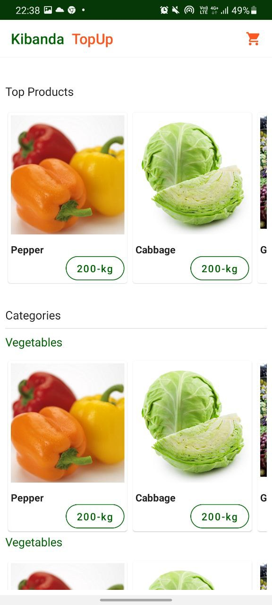

# Kibanda TopUp

**Work In Progress**

Demo project for Senior android Role

**Application Architecture**

The project is architecture in MVVM-modular Clean architure.

**Architecture Diagram**

<table>
<tr>
<td>

</td>

</tr>
</table>

# Modules
The application is divided into the following modules (Clean Architecture) forcusing on seperation of Concerns.

## 1 Customer

Contains app UI implementation, customer app. This compiles to Customer Apk.

## 2 Agent

Contains app UI implementation, Agent app. This compiles to Agent Apk.

## 3 Commons

Android Library module containing share utilities by customer and Agent app

## 4 Viewmodels

This modules has all the viewmodels tha communicate with the repositories in the datasource module.

## 5 data

This module is a data source, it provide data from api call and local database. It is consumed by the viewmodels

## 6 domain

This a java module that has the app use cases and the utility classes that are used in all the modules

**Used libraries**

1. Jetpack compose
2. Koin -Dependency Injection
3. Retrofit
4. Okhttp
5. RxJava

**Customer App**

<table>
<tr>
<td>

</td>
<td>

</td>
<td>

</td>
</tr>
</table>

**Agent App**

<table>
<tr>
<td>

</td>
<td>

</td>
<td>

</td>
</tr>
<td>

</td>
<td>
</tr>
</table>
